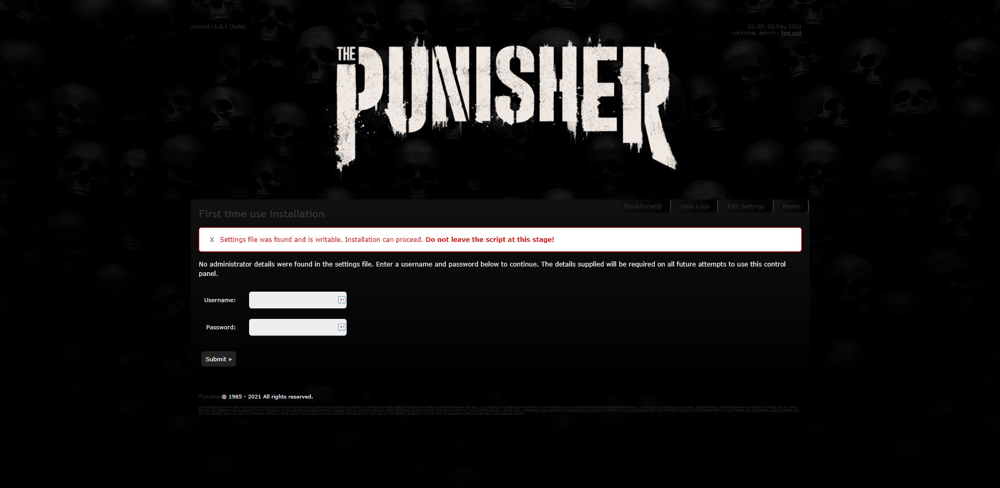
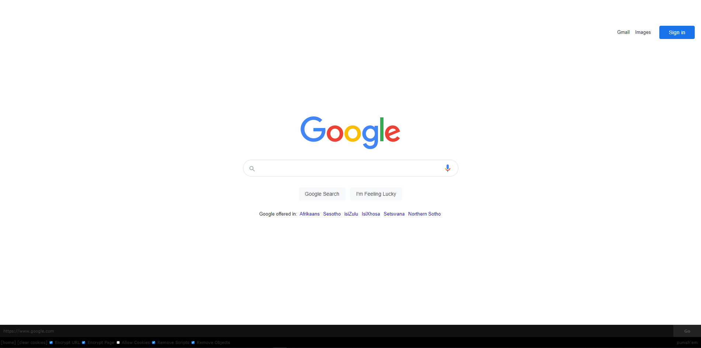
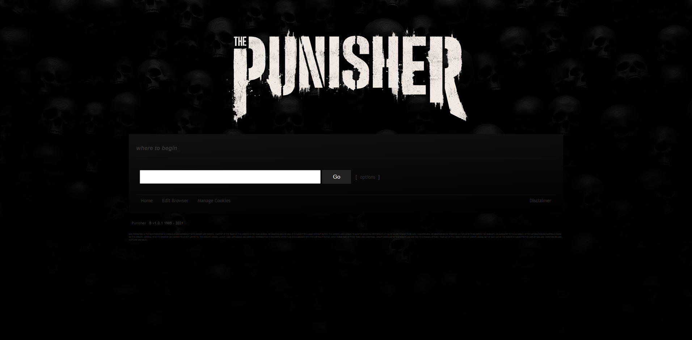

## Once Two Great Proxies <a href="https://github.com/donPabloNow/punisher">Punisher</a> & <a href="https://github.com/donPabloNow/.yxorp">PHP Proxy</a> Now there is only ONE!





# .xyorp

Web Proxy Application built on [**php-proxy library**](https://github.com/donPabloNow/php-proxy) ready to be installed on
your server

## Web-Proxy vs Proxy Server

Keep in mind that this proxy script may not function with sites/pages that are excessively script-heavy or have too many "dynamic components." This is a well-known drawback of web proxies. You should use a real proxy server to redirect your browser's HTTP requests via for such sites:

https://www.proxynova.com/proxy-software/

## Installation

It's important to remember that this is a **project**, not a library. It's not a good idea to install this using *require*. A project like this should be placed in your web server's public directory right away.

```bash
composer create-project donPabloNow/.xyorp:dev-master /var/www/
```

If you don't have composer or are attempting to host this app on a **shared hosting** or a VPS with limited rights (dreamhost.com), then download a pre-installed version of this app as a ZIP archive from the downloads area. [**Releases**](https://github.com/donPabloNow/.yxorp/releases/).

**Direct Link:**  
https://www.php-proxy.com/download/php-proxy.zip

## Keep it up-to-date

The application itself will be changed very seldom; the great majority of modifications will be made to its dependency packages, such as php-proxy.
Simply use this command once in a while to ensure that your proxy is constantly up to date.

```
composer update
```

#### config.php

This file will be loaded into the global Config class.

#### /templates/

This should have been titled "views," but we're keeping it as templates for now for historical reasons..

#### /plugins/

Although PHP-Proxy comes with a number of native plugins, users are allowed to create their own custom plugins, which may then be loaded automatically from this subdirectory. For an example, see /plugins/TestPlugin.php.
